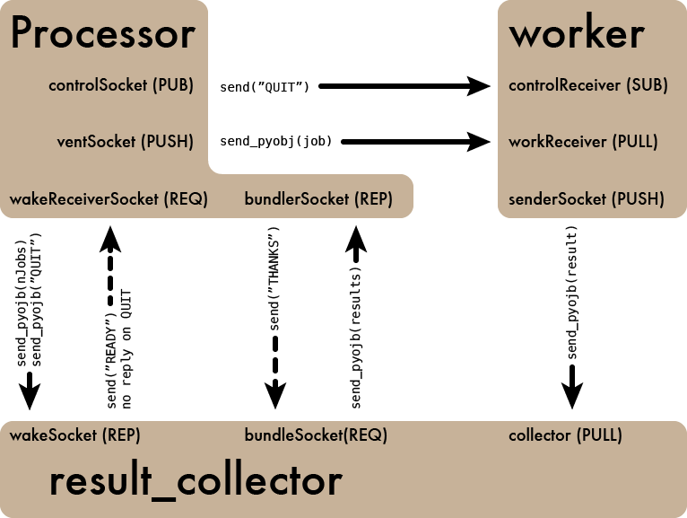

MapScale's Architecture
=======================

MapScale uses ZeroMQ (via pyzmq) to talk to workers and collect results.
The architecture is based on the `ventilator pattern`_, with additional patterns being employed to administer the workers and receiver.
In this section, we'll document each communication channel that MapScale uses to aid developers.
End users likely don't need to care about this.
Also note that this architecture is likely to change as I (Jonathan Sick) learn more of ZeroMQ's best practices.
This page will be updated as the architecture evolves.

Overview
--------

Users interact directly with an instance of the `Processor` class, but there are two other types of components that operate in individual process: the `result_collector` and several `worker` instances. Interactions between these components, including socket and message types are outlined in this diagram:

The MapScale Life Cycle
-----------------------

Its easier to understand the network of sockets by outlining the sequential life cycle of a MapScale `Processor` instance.

Start-Up Phase
^^^^^^^^^^^^^^

When a `Processor` instance is created, the `result_collector` is started in another process.
The `result_collector` acts as a sink in our `ventilator pattern`_, collecting results from workers.
A number of local workers can also be booted up.
When a worker starts up, the `startup()` method of your worker class is automatically run.

.. note:: We do not *yet* have any communication for when all the worker's `startup`s are complete.
   You may need to include a `sleep()` call if the startup() is lengthy.

Mapping Phase
^^^^^^^^^^^^^

When a sequence of jobs is submitted to your `Processor` instance, the first task is to tell the `result_collector` how many results to expect.
This is done with Processor's `wakeReceiverSocket`, sending a python integer.
This is a `request-reply`_ transaction, and Processor blocks until the `result_collector` acknowledges receipt.

Next, the jobs are sent to workers over the Processor's `ventSocket`.
By using the `ventilator pattern`_, jobs are automatically load balanced across workers.
Once jobs are sent, the `Processor` instance blocks with a `bundlerSocket.recv_pyobj()` call, waiting for results to be made available from the `result_collector`.

Turning our attention to the workers, we see that workers nominally run infinite loops--they are persistent servers until we shut them off. In the infinite runtime loop, the worker checks for messages using a `zmq.Poller`.
This poller effectively multiplexes several sockets together.
If a message is received over the `workReceiver` socket, the job message is receiver thought the socket's `recv_pyobj` method.
The job is passed as the sole argument to the user's work function
The work function's result is then sent via the `senderSocket`'s `send_pyobj` method to the `result_collector`.
As the worker continues to poll, it will process additional jobs.

Following the results to the `result_collector`, we see that it too has an infinite runtime loop that continuously polls sockets.
One socket that it checks for is the `wakeSocket`, where the `Processor` instance originally told the `result_collector` how many jobs to expect. 
In this case, the `result_collector` blocks until that number of messages is received over the `collector` socket from the workers.
The results are bundled into a list, and sent over the `bundlerSocket` back to the `Processor` instance, which has been blocking in anticipation of the results.

Before the result list is returned to the user, they must be sorted into the same order as the jobs were originally presented.
This is easy since each job was enumerated as it was pushed to workers, and that enumeration tag is carried with the result back to the `Processor`.

The Shutdown Phase
^^^^^^^^^^^^^^^^^^

Once jobs have been mapped once, or perhaps several times, the Processor is not longer needed.
We need to tell the server processes (the `result_collector` and all the workers) to shutdown.
This is achieved when the user calls the `shutdown` method.
Here, two signals are send.
First, over the `controlSocket`, a `"QUIT` message is broadcast to all workers.
When workers encounter this message in their polling they run the `cleanup` method in the user's work function and exit their runtime loop.
Second, a `"QUIT"` message is send to the `work_receiver`, which also terminates its runtime loop when that message is encountered. Note that to aid shutdown, `setsockopt(zmq.LINGER, 0)` is called on each socket in the `Processor`, telling those sockets that they can exit immediately without waiting for replies.

Python ZeroMQ Reading List
--------------------------

The ZeroMQ messaging framework takes a bit of time to wrap your head around, but luckily a good deal of lucid documentation has been written (particuarly around the Python ZMQ package).
Here is a list of pages that could be consulted before working on the MapScale code base:

* `The ZeroMQ Guide <http://zguide.zeromq.org/>`_ is hilariously written and spells out the various sockets and design patterns used by ZeroMQ. MapScale takes advantage of the `ventilator pattern`_, the `pubsub pattern`_ and the `request-reply`_ pattern, in particular.
* Brian Knox (Tao te Tek) wrote an excellent article on `ZeroMQ as a Python multiprocessing alternative <http://taotetek.wordpress.com/2011/02/02/python-multiprocessing-with-zeromq/>`_, which inspired this project. He also `compared the performance of ZeroMQ and Queue <http://taotetek.wordpress.com/2011/02/03/python-multiprocessing-zeromq-vs-queue/>`_ in a separate post.
* Nicholas Piel `wrote a broad introduction to ZeroMQ and PyZMQ <http://nichol.as/zeromq-an-introduction>`_.
* In this three-part series, Stefan Scherfke goes in-depth with Python ZeroMQ best-practices:

  1. `Designing a PyZMQ Application <http://stefan.sofa-rockers.org/2012/02/01/designing-and-testing-pyzmq-applications-part-1/>`_
  2. `Unit Testing PyZMQ Applications <http://stefan.sofa-rockers.org/2012/02/07/designing-and-testing-pyzmq-applications-part-2/>`_
  3. `Process and System Testing <http://stefan.sofa-rockers.org/2012/02/15/designing-and-testing-pyzmq-applications-part-3/>`_

* Brian Knox also wrote about `a multiprocessing design with batch acknowledgements <http://blog.aggregateknowledge.com/2011/06/23/batch-acknowledged-pipelines-with-zeromq/>`_, which may keep queue sizes smaller and improve stability.
* In `Responsible workers with ZeroMQ <http://www.rfc1149.net/blog/2010/12/08/responsible-workers-with-0mq/>`_, Samuel Tardin proposes a broker for works that could improve load balancing. Its an interesting design that we might consider for MapScale; particularly when workers-across-networks is introduced.

.. _`ventilator pattern`: http://zguide.zeromq.org/page:all#Divide-and-Conquer
.. _`pubsub pattern`: http://zguide.zeromq.org/page:all#Getting-the-Message-Out
.. _`request-reply`: http://zguide.zeromq.org/page:all#Ask-and-Ye-Shall-Receive
